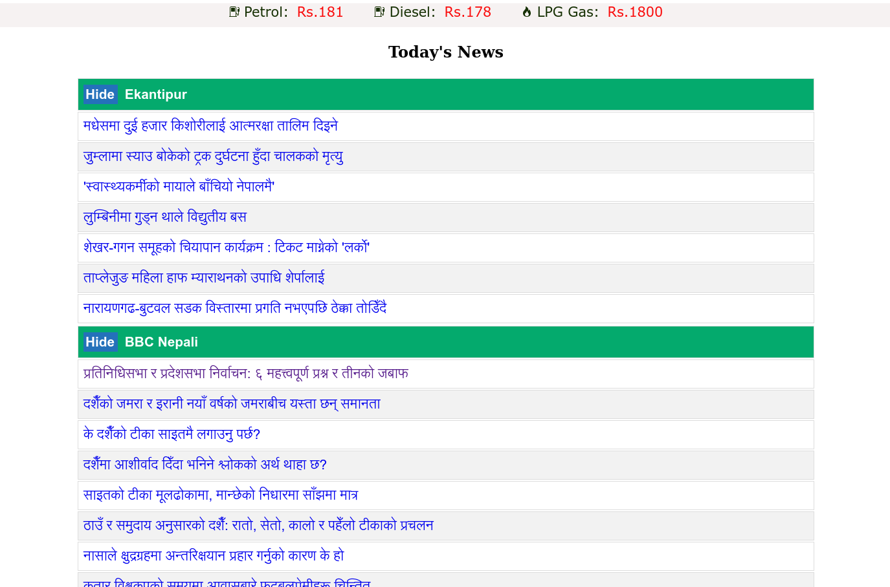

# News-Aggregator

- A basic news agggregator that scrapes from Nepali news portal(s) and serves them via a HTTP webserver. Written in go.
- Supports Ekantipur, BBC Nepali news and The Kathmandu Post
- Shows Daily Petroleum Prices

## Screenshots

# To-Do
- Daily gold and silver prices
- Daily currency exchange rates
- Better responsive layout
- More news sites