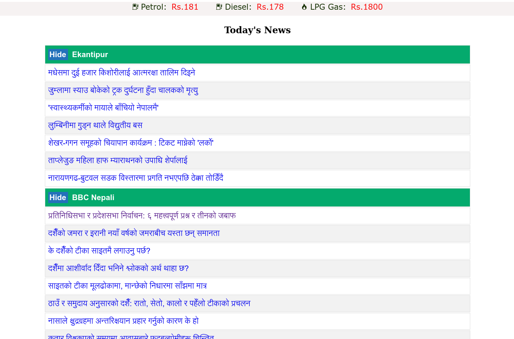

# khabar-haru

> Khabar means `News` in Nepali.

- A Nepali news agggregator that scrapes from Nepali news portal(s) in an hourly interval and serves them via a HTTP webserver. Written in `Go`.
- Supports Ekantipur, BBC Nepali news and The Kathmandu Post
- Shows Daily Petroleum Prices
- Easily Deployable (single binary)

## Screenshots



## Run and Build

```bash
# To run
go run ./

# To build
go build ./

```

# To-Do

- [ ] Daily gold and silver prices
- [ ] Daily currency exchange rates
- [ ] Better responsive layout
- [ ] More news sites
